# Database ERD - Visual Reference

## High-Resolution Entity Relationship Diagram

## Detailed ERD with Indexes and Constraints

```mermaid
graph TB
    subgraph USERS["👤 USERS (Shop Owners)"]
        U_PK["🔑 id: TEXT PK"]
        U_EMAIL["📧 email: VARCHAR(255) UNIQUE"]
        U_PASS["🔒 password_hash: TEXT"]
        U_NAME["👨 name: VARCHAR(255)"]
        U_PHONE["📱 phone: VARCHAR(20)"]
        U_CREATED["📅 created_at: TIMESTAMPTZ"]
        U_UPDATED["🔄 updated_at: TIMESTAMPTZ"]
    end
    
    subgraph CUSTOMERS["👥 CUSTOMERS (End Customers)"]
        C_PK["🔑 id: TEXT PK"]
        C_USER_FK["🔗 user_id: TEXT FK"]
        C_NAME["👤 name: VARCHAR(255)"]
        C_PHONE["📱 phone: VARCHAR(20)"]
        C_ADDRESS["🏠 address: TEXT"]
        C_EMAIL["📧 email: VARCHAR(255) NULL"]
        C_CREATED["📅 created_at: TIMESTAMPTZ"]
        C_UPDATED["🔄 updated_at: TIMESTAMPTZ"]
    end
    
    subgraph SHIPMENTS["📦 SHIPMENTS (Orders)"]
        S_PK["🔑 id: TEXT PK"]
        S_USER_FK["🔗 user_id: TEXT FK"]
        S_CUST_FK["🔗 customer_id: TEXT FK"]
        S_TYPE["🏷️ type: shipment_type ENUM"]
        S_MODE["🚚 mode: shipment_mode ENUM"]
        S_START["📍 start_location: VARCHAR(500)"]
        S_END["🎯 end_location: VARCHAR(500)"]
        S_COST["💵 cost: NUMERIC(10,2)"]
        S_TOTAL["💰 calculated_total: NUMERIC(10,2)"]
        S_DELIVERED["✅ is_delivered: BOOLEAN"]
        S_DATE["📆 delivery_date: TIMESTAMPTZ NULL"]
        S_CREATED["📅 created_at: TIMESTAMPTZ"]
        S_UPDATED["🔄 updated_at: TIMESTAMPTZ"]
    end
    
    USERS -->|"1:N CASCADE"| CUSTOMERS
    USERS -->|"1:N CASCADE"| SHIPMENTS
    CUSTOMERS -->|"1:N RESTRICT"| SHIPMENTS
    
    style USERS fill:#e3f2fd,stroke:#1976d2,stroke-width:3px
    style CUSTOMERS fill:#f3e5f5,stroke:#7b1fa2,stroke-width:3px
    style SHIPMENTS fill:#fff3e0,stroke:#f57c00,stroke-width:3px
```

## Index Strategy Visualization

```mermaid
graph LR
    subgraph "🔍 USERS Indexes"
        UI1["users_email_idx<br/>📧 email"]
        UI2["users_phone_idx<br/>📱 phone"]
    end
    
    subgraph "🔍 CUSTOMERS Indexes"
        CI1["customers_user_id_idx<br/>🔗 user_id"]
        CI2["customers_phone_idx<br/>📱 phone"]
        CI3["customers_email_idx<br/>📧 email"]
    end
    
    subgraph "🔍 SHIPMENTS Indexes"
        SI1["shipments_user_id_idx<br/>🔗 user_id"]
        SI2["shipments_customer_id_idx<br/>🔗 customer_id"]
        SI3["shipments_type_idx<br/>🏷️ type"]
        SI4["shipments_is_delivered_idx<br/>✅ is_delivered"]
        SI5["shipments_created_at_idx<br/>📅 created_at"]
    end
    
    subgraph "🎯 COMPOSITE Indexes"
        COMP1["user_delivery_status_idx<br/>🔗 user_id + ✅ is_delivered"]
        COMP2["user_type_idx<br/>🔗 user_id + 🏷️ type"]
        COMP3["customer_delivery_idx<br/>🔗 customer_id + ✅ is_delivered"]
    end
    
    style UI1 fill:#bbdefb,stroke:#1976d2
    style UI2 fill:#bbdefb,stroke:#1976d2
    style CI1 fill:#e1bee7,stroke:#7b1fa2
    style CI2 fill:#e1bee7,stroke:#7b1fa2
    style CI3 fill:#e1bee7,stroke:#7b1fa2
    style SI1 fill:#ffe0b2,stroke:#f57c00
    style SI2 fill:#ffe0b2,stroke:#f57c00
    style SI3 fill:#ffe0b2,stroke:#f57c00
    style SI4 fill:#ffe0b2,stroke:#f57c00
    style SI5 fill:#ffe0b2,stroke:#f57c00
    style COMP1 fill:#c8e6c9,stroke:#388e3c
    style COMP2 fill:#c8e6c9,stroke:#388e3c
    style COMP3 fill:#c8e6c9,stroke:#388e3c
```

## Relationship Flow Diagram

```mermaid
sequenceDiagram
    participant U as 👤 User (Shop Owner)
    participant C as 👥 Customer
    participant S as 📦 Shipment
    
    U->>C: Creates Customer
    Note over C: CASCADE on User Delete
    
    U->>S: Creates Shipment
    Note over S: CASCADE on User Delete
    
    C->>S: Associated with Shipment
    Note over S: RESTRICT on Customer Delete
    
    S->>S: Track Delivery Status
    Note over S: is_delivered: true/false
    
    S-->>C: Delivered to Customer
    S-->>U: Updates User Stats
```

## Data Flow & Cascade Rules

```mermaid
flowchart TD
    A[👤 USER ACCOUNT] --> B{Delete User?}
    B -->|YES| C[🗑️ CASCADE DELETE]
    C --> D[❌ All Customers Deleted]
    C --> E[❌ All Shipments Deleted]
    
    F[👥 CUSTOMER] --> G{Delete Customer?}
    G -->|Has Shipments| H[🚫 RESTRICT - Cannot Delete]
    G -->|No Shipments| I[✅ Allow Delete]
    
    J[📦 SHIPMENT] --> K{Update Status}
    K -->|Deliver| L[✅ is_delivered = true]
    K -->|Pending| M[⏳ is_delivered = false]
    
    style A fill:#e3f2fd,stroke:#1976d2,stroke-width:3px
    style F fill:#f3e5f5,stroke:#7b1fa2,stroke-width:3px
    style J fill:#fff3e0,stroke:#f57c00,stroke-width:3px
    style C fill:#ffcdd2,stroke:#c62828,stroke-width:2px
    style H fill:#ffcdd2,stroke:#c62828,stroke-width:2px
    style L fill:#c8e6c9,stroke:#388e3c,stroke-width:2px
```

## Enum Value Breakdown

---

**Note:** To view these diagrams properly:
1. Open this file in a Markdown viewer that supports Mermaid (GitHub, GitLab, VS Code with Mermaid extension)
2. Or use online Mermaid Live Editor: https://mermaid.live/
3. Or install VS Code extension: `bierner.markdown-mermaid`

**Generated:** October 6, 2025  
**Schema Version:** 0000_nervous_chimera
